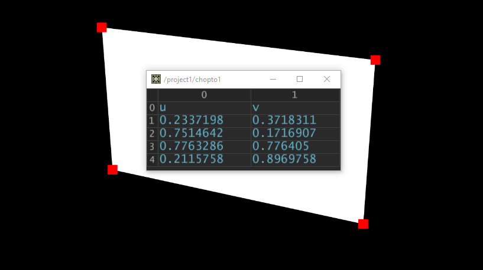

# MatrixCHOP (Matrix Multiply CHOP)
The MatrixCHOP produces the screen-space coordinates of points based on a camera and an aspect ratio. The inputs:

* Positions (XYZ): 3 channels and any number of samples
* Camera View and Projection Matrix : 16 channels and one sample. Check the demo project for an easy example.

The output:

* The UV-coordinates of the positions in the camera's view. UVs are typically between [0,0] and [1,1] if they're inside the camera's view, but the MatrixCHOP does not clamp values or delete out-of-bounds samples.

# Demo
In this image we render a white rectangle at an oblique angle. The MatrixCHOP takes the world-space positions of the rectangle's points, the camera's full view-projection-matrix, and then produces 4 new points. These 4 points are then depicted in a separate render of red squares. These squares land exactly on the corners in the first render, confirming that the MatrixCHOP outputs correct screen-space coordinates.

## Instructions
[Build the dll yourself](https://docs.derivative.ca/Write_a_CPlusPlus_Plugin), or use a compiled DLL file. `MatrixCHOP/MatrixCHOP/Plugins/MatrixCHOP.dll` has been compiled as a [Custom Operator](https://docs.derivative.ca/Custom_Operators) for TouchDesigner 2019.19160.

## Changelog
* 2019-09-19 Public release
